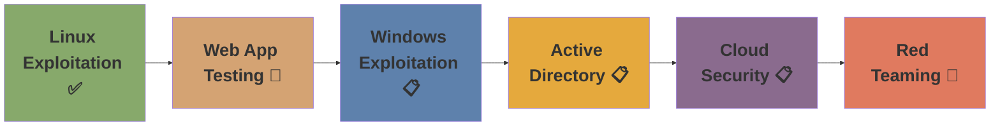

<div align="center">
  
  
  
  <br/>
  
  
  
  
  
  <br/>
  
  
  
  
  
  
  
  
  <br/>
  <br/>
  
  
  
</div>

---

## 🛡️ **Welcome to My Cybersecurity Arsenal**

> *"The quieter you become, the more you are able to hear."* — Kali Linux philosophy

This repository serves as the **central hub** for my hands-on cybersecurity journey. Every lab, every exploit, and every report documented here was executed in **isolated, controlled environments** for pure educational growth.

<details open>
<summary><strong>📌 Quick Navigation</strong></summary>
<br/>

| Section | Description |
|---------|-------------|
| [🔬 Active Labs](#-active-labs) | Current projects and vulnerable targets |
| [📊 Lab Statistics](#-lab-statistics) | Progress tracking and metrics |
| [🛠️ Toolkit](#️-toolkit) | Tools and technologies mastered |
| [📈 Learning Roadmap](#-learning-roadmap) | Current and future learning objectives |
| [📚 Resources](#-resources) | Documentation and references |
| [⚠️ Legal](#️-legal) | Disclaimer and usage policy |

</details>

---

## 🔬 **Active Labs**

<div align="center">

| Lab | Focus Area | Status | Key Vulnerabilities | Documentation |
|-----|------------|--------|---------------------|---------------|
| 🐉 **Metasploitable 2** | Linux Exploitation | ✅ Complete | 10+ CVEs including vsftpd backdoor, Samba RCE | [View Report](metasploit2/reports/) |
| 🌐 **DVWA** | Web Application | 🔄 In Progress | SQLi, XSS, CSRF, Command Injection | [View Progress](dvwa-lab/) |
| 🎯 **Windows 7 (Legacy)** | Windows Exploitation | 📋 Planned | EternalBlue, MS17-010 | Coming Soon |
| 🔥 **Active Directory** | Domain Exploitation | 📋 Planned | Kerberoasting, Golden Ticket | Coming Soon |
| 🌿 **Tails OS** | Anonymity Research | 📋 Planned | Privacy & Forensics | Coming Soon |
| ☁️ **CloudGoat** | Cloud Security | 📋 Planned | AWS Misconfigurations | Coming Soon |

</div>

---

## 📊 **Lab Statistics**

<div align="center">
  
| Metric | Count |
|--------|-------|
| **Vulnerabilities Exploited** | 10+ |
| **CVEs Mapped** | 8 |
| **Critical Severity (10.0)** | 4 |
| **Hours of Practice** | 50+ |
| **Pages of Documentation** | 25+ |
| **Screenshots Captured** | 15+ |

</div>

<details>
<summary><strong>🏆 Top Exploits Demonstrated</strong></summary>

| Exploit | CVE | CVSS | Time to Root |
|---------|-----|------|---------------|
| vsftpd 2.3.4 Backdoor | CVE-2011-2523 | 10.0 | 30 seconds |
| Samba Usermap Script | CVE-2007-2447 | 10.0 | 1 minute |
| UnrealIRCd Backdoor | CVE-2010-2075 | 10.0 | 1 minute |
| PostgreSQL RCE + Priv Esc | CVE-2007-3278 | 9.0 | 2 minutes |

</details>

---

## 🛠️ **Toolkit**

<div align="center">
  
### **Reconnaissance & Enumeration**


### **Exploitation Frameworks**


### **Post-Exploitation**


### **Scripting & Automation**


</div>

---

## 📈 **Learning Roadmap**


### 📚 **Resources**
Official Documentation
Kali Linux Docs

Metasploit Unleashed

OWASP Testing Guide

Learning Platforms
Hack The Box

TryHackMe

PortSwigger Web Security Academy

CVE Databases
Exploit-DB

NVD

## ⚠️ **Legal**
<div align = "center">

```bash
┌─────────────────────────────────────────────────────────────────┐
│                    EDUCATIONAL PURPOSE ONLY                     │
├─────────────────────────────────────────────────────────────────┤
│  All activities documented in this repository were performed    │
│  in isolated VirtualBox environments with Host-Only networks.   │
│                                                                 │
│  NEVER use these techniques against systems you don't own or    │
│  lack explicit written permission to test.                      │
│                                                                 │
│  Unauthorized access is illegal under:                          │
│  • CFAA (USA) • Computer Misuse Act (UK) • IT Act (India)       │
└─────────────────────────────────────────────────────────────────┘
```
</div>

📄 [Full Legal Disclaimer](DISCLAIMER.md) — Please read before proceeding.

---

## 📬 **Connect With Me**

<div align="center">

[](https://linkedin.com/in/gokul-g-7ak2529)
[](https://github.com/Gokul711-dev)
[](https://twitter.com/Gokulg07dev)
[](https://ahisevenstudio.netlify.app)

</div>

---

<div align="center">
  
  
  <sub>Last Updated: June 2026 | Maintained with ☕ and persistence</sub>
</div>
